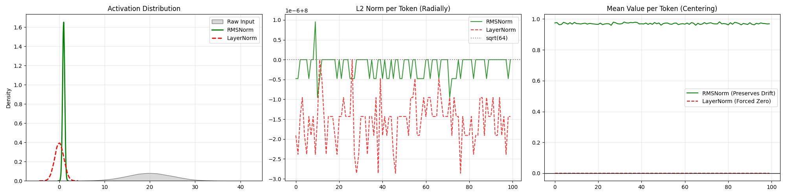
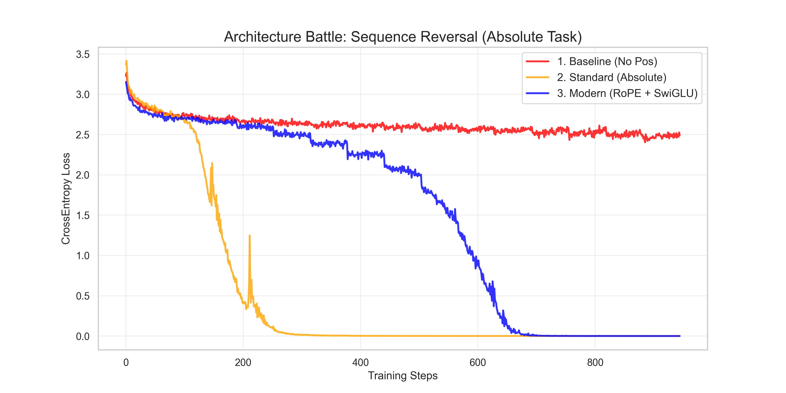
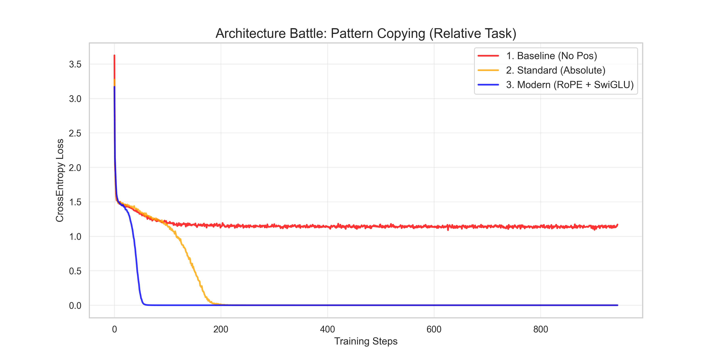
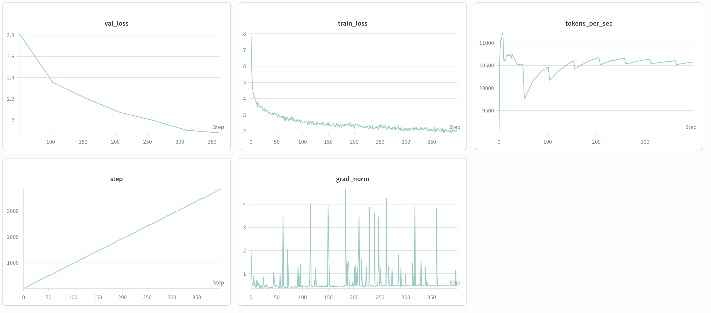
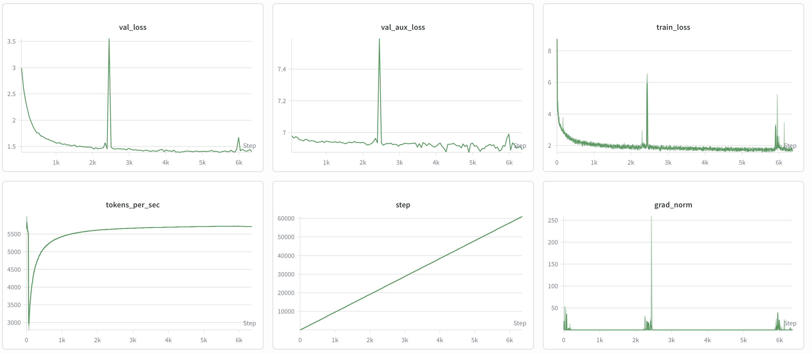
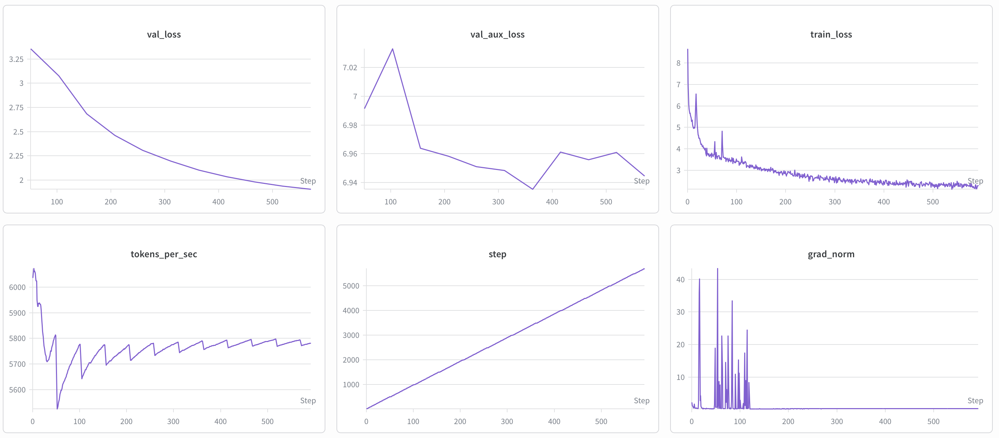
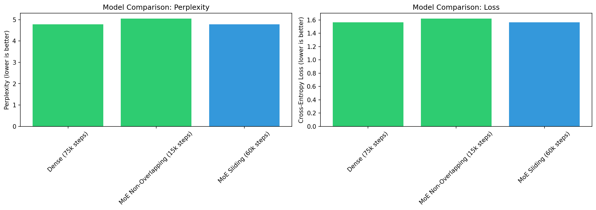

# transformer-from-scratch

A from-scratch implementation of a modern decoder-only transformer, built as a learning exercise
to internalise the components of contemporary LLM architectures end-to-end: RoPE, RMSNorm, SwiGLU,
Grouped-Query Attention, KV caching, and a vectorised sparse Mixture-of-Experts layer. Trained to
70M parameters on a single M2 Pro (MPS).

This is a pedagogical repository, not a research contribution. The goal was to build every
component — not just use it — and to verify each one against the properties claimed in the
original papers.

---

## What's here

| Component | Reference | Notes |
|---|---|---|
| Scaled dot-product attention + MHA | Vaswani et al., 2017 | Baseline, used for inductive-bias comparisons |
| Sinusoidal positional encoding | Vaswani et al., 2017 | Kept as control against RoPE |
| RoPE | Su et al., 2021 | Both interleaved and half-split variants; verified equivalent |
| RMSNorm | Zhang & Sennrich, 2019 | Replaces LayerNorm throughout |
| SwiGLU FFN | Shazeer, 2020 | Hidden dim scaled by 8/3 to match FFN parameter count |
| Grouped-Query Attention | Ainslie et al., 2023 | Mean-pooled from MHA checkpoints; 5D broadcast formulation |
| KV cache | — | Separate prefill and decode paths; pre-allocated tensor |
| Sparse Top-2 MoE | Shazeer et al., 2017; Lepikhin et al., 2020 | Fully vectorised dispatch via cumsum-as-sort |
| Weight tying | Press & Wolf, 2016 | Embedding and LM head share weights |

---

## Verification experiments

Each component was checked against a property from the corresponding paper rather than just
reproduced by shape.

**RoPE unitarity.** `‖RoPE(x)‖ ≈ ‖x‖` to within 1e-6. Confirms RoPE is an orthogonal
transformation and does not rescale activations.

**RoPE relative invariance.** The attention score between positions `(5, 10)` is numerically
equal to `(105, 110)`. Confirms the absolute index cancellation in the dot product.

**RoPE interleaved vs half-split.** Both produce identical attention scores; half-split (Llama
style) is used in the main model for contiguous-memory speed.

**RMSNorm vs LayerNorm.** Empirical comparison across three dimensions: activation distribution,
L2 norm preservation, and mean centering behaviour. RMSNorm preserves signal magnitude and mean
drift; LayerNorm forces zero mean and shows erratic L2 norm oscillation across tokens.



**Inductive bias experiment (week 3).** The cleanest result in the repo. Two synthetic tasks,
two models:

| Task | Structure | Winner | Notes |
|---|---|---|---|
| Sequence reversal | Requires absolute indexing | Absolute PE | RoPE underperforms; cannot infer anchored coordinates |
| Repeat-copy at fixed offset | Requires relative pattern | RoPE | Converges ~3× faster |

The absolute-PE model on the reversal task exhibits a grokking-style cliff: flat loss for ~180
epochs before a sharp drop to near-zero. This is consistent with the memorisation-before-
generalisation pattern reported in the grokking literature.




---

## Design choices 

**GQA: pool K/V first, then apply RoPE.** Because RoPE is a linear (per-dimension rotation)
operation and mean-pooling is linear, the two commute. Applying RoPE after pooling reduces the
number of trigonometric operations on the K side by `n_heads / n_groups` (6× → 2× in the default
config, so a 66% reduction in RoPE ops on the key path). Standard implementations apply RoPE
before pooling.

**GQA as 5D broadcast.** Rather than repeat-interleaving K/V to match Q heads, the forward pass
reshapes to `(B, G, H/G, S, D)` on the Q side and `(B, G, 1, S, D)` on the K/V side, and lets
PyTorch broadcast the group dimension. Avoids the memory duplication of `repeat_interleave`.

**KV cache as pre-allocated tensor, not list.** The cache is a `(batch, heads, max_seq, dim)`
tensor with a `start_pos` index, not a Python list that grows with `.append()`. Pre-allocation
avoids per-step tensor reallocation and keeps the cache on-device.

**Cache *after* RoPE, not before.** Storing post-rotation K means no re-application on retrieval.
Storing pre-rotation K would require applying RoPE to the full history on every decode step.

**Prefill vs decode split.** Prefill processes the full prompt in parallel and is compute-bound;
decode processes one token at a time against the cached history and is memory-bound. The forward
pass branches on whether a cache is provided.

**Vectorised MoE dispatch.** Top-2 gating with a fixed per-expert capacity. Assignment to buffer
slots is done via `cumsum` over one-hot selections — each token gets a unique "ticket number"
without a Python loop. Tokens exceeding capacity are dropped and survive through the residual
connection. Dispatch mask (binary, for routing) and combine weights (float, for output mixing)
are computed separately — control plane vs data plane.

**MoE block as FFN substitution.** `SparseMoEBlock` extends `ModernDecoder` and replaces the
SwiGLU FFN with a `MoELayer`, keeping attention and normalisation unchanged. Dropped tokens
pass through via the residual connection with zero MoE contribution — `x + 0 = x`.

**MoE load balancing.** Both auxiliary loss (GShard) and Z-loss (ST-MoE) are implemented.
Z-loss and aux loss share a single coefficient (`aux_loss_coef=0.01` in the trainer) rather than
independent scales. A separate `z_loss_coef=0.001` was tested but caused instability on this
hardware and batch size configuration. Single coefficient produces stable convergence — confirmed
by training curves. The auxiliary loss accumulates over layers: with 6 layers, the theoretical
minimum aux loss is ~6.0 (1.0 per layer for perfectly balanced routing), not 0.

---

## Scale

- Baseline: ~10M params (d=256, 4 layers, 4 heads), trained on TinyShakespeare
- Base: 70M params (d=512, 6 layers, 8 heads), trained on TinyShakespeare → TinyStories
- Hardware: Apple M2 Pro (MPS). Batch size 32 at d=512; batch 64 triggers swap thrashing from
  activation memory, not parameter memory
- Throughput: ~11.5k tokens/sec (dense), ~5.5k–5.9k tokens/sec (MoE — routing overhead)

**Dense baseline (70M) — 375 steps:**



Val loss descends smoothly from 2.8 to ~1.9. Grad norm spiky but bounded (~4 peak), consistent
with clipping at 1.0. Throughput stable at ~10,500 tokens/sec after warmup.

**MoE — overlapping experts, 60,000 steps:**



Val loss reaches ~1.5, lower than the dense baseline at equivalent depth. The sharp spike at
~2,500 steps (grad norm peaking at 250, simultaneous jump in val_loss and val_aux_loss) is a
router instability event from an earlier training configuration before Z-loss stabilisation was
tuned. The model recovers cleanly via gradient clipping.

**MoE — non-overlapping experts, 550 steps:**



Val loss descends from 3.3 to ~2.0. Val aux loss oscillates narrowly around 6.95 — per-layer
aux loss of ~1.16, close to the theoretical minimum of 1.0 for perfectly balanced Top-2 routing.
Grad norm spikes are front-loaded (first ~100 steps) and then flat — the signature of a router
that has found a stable equilibrium. Throughput ~5,800 tokens/sec.


**Checkpoint comparison — Dense vs MoE:**




MoE non-overlapping reaches near-parity with the dense baseline at 15k steps 
vs 75k steps — approximately 5× fewer training steps for equivalent perplexity.

---

## Training infrastructure

- Optimiser: AdamW with cosine schedule and linear warmup
- Gradient clipping at norm 1.0; observed norms ~0.5 at steady state (dense)
- Weights & Biases logging with periodic greedy-decode samples every 500 steps
- Checkpointing keyed on step, saved every 5,000 steps
- Trainer handles both dense and MoE models transparently via a `_forward` helper
  that normalises tuple (MoE) and tensor (dense) outputs

---

## What's not here (honest scope)

- No CUDA kernels. FlashAttention tiling is referenced but not implemented at the kernel level;
  attention falls back to standard PyTorch
- No distributed training. Single-device MPS only. FSDP/DDP would be the next step
- No quantisation or pruning
- No post-training (SFT/RLHF/RLVR). That work lives elsewhere

---

## Repository layout

```
src/transformer_from_scratch/
├── multi_head_attention.py       # Standard MHA
├── multi_head_attention_rope.py  # MHA with RoPE + KV cache
├── rotary_positional_embeddings.py
├── positional_embeddings.py
├── rms_norm.py
├── activations.py                # SwiGLU and variants
├── transformer_blk.py            # Decoder block (Pre-LN)
├── transformer.py                # Full model wrapper with weight tying
├── sparse_moe_block.py           # Vectorised MoE layer (FFN substitution)
├── sparse_moe_transformer.py     # MoE transformer variant
├── moe.py                        # MoE routing: Top-2 gating, aux loss, Z-loss
├── trainer.py                    # Training loop with W&B integration
├── data_pipeline.py              # Data loading and batching
├── inference.py                  # Autoregressive generation
└── config.py                     # Model configurations

labs-viz/
├── architecture_validator_rope_vs_abs.py    # RoPE vs absolute PE comparison
├── architecture_validator_pre_post_norm.py  # Pre-norm vs post-norm comparison
├── training_sparse_moe.py
├── compare_runs.py
├── grad_lab.py                   # Gradient flow analysis
└── plots/                        # Verification and training plots

tests/
├── test_multiheadattention.py
├── test_rope_attention.py
├── test_GQA.py
└── test_transformer_blocks.py

reports/                          # Weekly research logs (weeks 1–8)
```

---

## Tests

```bash
pytest tests/
```

Tests cover: multi-head attention shapes, RoPE correctness and norm preservation, GQA
broadcasting, transformer block forward pass.

---

## Requirements

```bash
uv sync
# or
pip install torch wandb tiktoken
```

Tested on Apple M2 Pro (MPS). CUDA-compatible — swap `device = "mps"` for `device = "cuda"`
in config.

---

## References

- Vaswani et al., *Attention Is All You Need*, 2017
- Su et al., *RoFormer: Enhanced Transformer with Rotary Position Embedding*, 2021
- Zhang & Sennrich, *Root Mean Square Layer Normalization*, 2019
- Shazeer, *GLU Variants Improve Transformer*, 2020
- Ainslie et al., *GQA: Training Generalized Multi-Query Transformer Models*, 2023
- Shazeer et al., *Outrageously Large Neural Networks: The Sparsely-Gated MoE Layer*, 2017
- Lepikhin et al., *GShard: Scaling Giant Models with Conditional Computation*, 2020
- Dao et al., *FlashAttention*, 2022 (referenced, not implemented)

---

## Background

Built as part of a structured self-study curriculum to understand modern LLM architecture from
the ground up before working on post-training and RL fine-tuning systems. The weekly research
logs in `/reports` document the learning process including dead ends, debugging sessions, and
empirical comparisons between architectural variants.

---

*Rui Sá Pereira. Built during evenings and weekends, Dec 2025 – Feb 2026.*